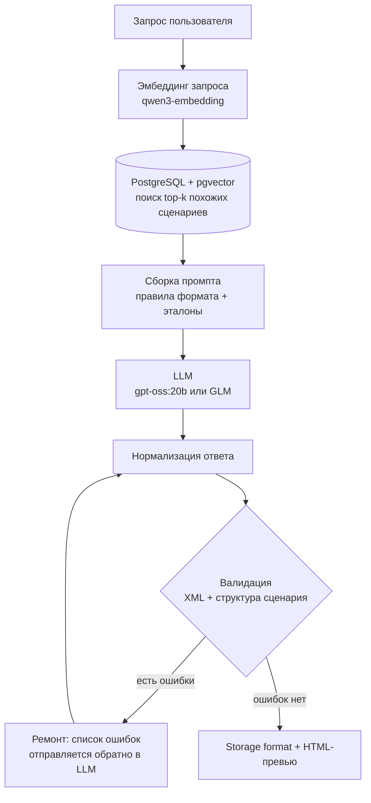

# AI Scenario Generator

Сервис на основе RAG, который по текстовому запросу генерирует пошаговый сценарий документации и сразу выдаёт его в формате Confluence storage format (XHTML), готовом для вставки на страницу Confluence. Также доступно сохранение в .html или прямое копирование текста из интерфейса.

Сервис создан для автоматизации написания типовых сценариев при работе с платформой BI.Qube. Существующие сценарии, написанные разработчиками платформы, однотипны по структуре (вступление, этапы, пронумерованные шаги), и новый сценарий удобно писать «по образцу» уже существующих. Генератор находит самые похожие сценарии в векторной базе, передаёт их LLM как эталоны стиля, генерирует новый сценарий и проверяет результат валидатором, прежде чем показать его пользователю.

В настоящий момент сервис дорабатывается и используется внутри компании. В данном репозитории представлена лишь демо-версия.

## Демонстрация


## Как это работает



1. **Подготовка исходного эталона.** Эталонные сценарии из Confluence были загружены в качестве сырого raw-слоя в БД в Postgres. Далее, используя настроенный ETL процесс, загруженные исходные данные были приведены в удобную форму для векторизации и переноса в векторную БД на Postgres с pgvector.
2. **Векторный поиск.** Векторизуется только запрос пользователя. Эмбеддинги сценариев заранее посчитаны и хранятся в PostgreSQL, поэтому поиск сводится к одному SQL-запросу с оператором косинусной дистанции `<=>` из pgvector. Перед поиском проверяется, что размерность вектора запроса совпадает с размерностью в таблице: если сменить модель эмбеддингов и не пересобрать данные, сервис упадёт с понятной ошибкой, а не вернёт мусор.
3. **Генерация.** Найденные сценарии передаются модели как образцы стиля вместе с формализованными правилами Confluence storage format и структуры сценария.
4. **Нормализация.** Из ответа снимаются обёртки в markdown-блоки кода, а также артефакты экспорта Confluence (inline-цвета, служебные атрибуты `data-*`), которые модель копирует из примеров.
5. **Валидация и ремонт.** Результат разбирается через `lxml` и проверяется по двум группам правил (см. ниже). Если найдены ошибки, их список отправляется модели на исправление. Исправленный вариант принимается, только если в нём меньше ошибок, чем в текущем.

## Возможности

- Генерация сценария сразу в Confluence storage format, включая макросы `info`, `note`, `code`, `status`.
- Валидатор storage format: корректность XML, белый список элементов, правила вложенности (`li` только в `ul`/`ol`, `td` только в `tr` и т.д.), запрет событийных атрибутов `on*` и ссылок `javascript:`/`data:`.
- Проверка структуры сценария: шаги в формате «Шаг №: Название», плоские и двухуровневые сценарии (этапы и шаги внутри них), отсутствие раздела «План шагов» и заголовка `h1`.
- Автоматический цикл ремонта ответа модели по списку ошибок валидатора.
- Подсчёт расхода токенов по этапам (эмбеддинг, генерация, ремонт), включая токены рассуждения (reasoning).
- Два взаимозаменяемых LLM-провайдера, переключаемых одной переменной окружения: локальная `gpt-oss:20b` через Ollama и облачная GLM через Z.ai.
- Веб-интерфейс на Streamlit: выбор числа эталонов, просмотр найденных сценариев с дистанцией, HTML-превью, исходный storage format, скачивание `.xml` и `.html`, автосохранение.

## Стек

| Область | Технологии |
|---|---|
| Язык и окружение | Python 3.14+, uv |
| LLM | gpt-oss:20b (Ollama), GLM (Z.ai), OpenAI SDK |
| Эмбеддинги | qwen3-embedding:4b (Ollama) |
| Хранилище | PostgreSQL + pgvector, psycopg2 |
| Обработка XHTML | lxml |
| Интерфейс | Streamlit |
| Качество кода | pytest, ruff |

## Архитектурные решения

- **Единая точка входа.** Весь пайплайн собран в функции `generate_scenario()`. Интерфейс Streamlit отвечает только за ввод и отображение, поэтому логику можно вызвать из CLI или тестов без UI (в репозитории только версия с интерфейсом Streamlit).
- **Внедрение зависимостей.** Клиенты LLM и эмбеддингов передаются в пайплайн параметрами и описаны протоколами. В тестах они подменяются фейковыми реализациями, без обращения к реальным моделям.
- **Fail-fast конфигурация.** Настройки читаются из `.env` один раз и валидируются при старте: если переменная не задана, сервис сразу сообщает, какой именно.
- **Правила формата в одном месте.** Требования к storage format описаны в коде рядом с валидатором, чтобы промпт и проверка не расходились.
- **Весь SQL в одном модуле.** Работа с БД изолирована в `db/repository.py`.

## Структура проекта

```
├── app/
│   └── ui.py                 # Streamlit-интерфейс
├── src/ai_scenario/
│   ├── config.py             # загрузка и проверка настроек из .env
│   ├── models.py             # модели домена
│   ├── usage.py              # учёт токенов по этапам
│   ├── rendering.py          # HTML-превью storage format
│   ├── db/repository.py      # векторный поиск в pgvector
│   ├── llm/                  # клиенты LLM и эмбеддингов, фабрика провайдеров
│   ├── rag/                  # пайплайн, промпты, правила структуры сценария
│   └── storage/              # нормализация и валидация storage format
├── scripts/                  # проверка подключений и CLI-валидатор
└── tests/                    # тесты pytest
```

## Быстрый старт

### Требования

- Python 3.13+ и [uv](https://docs.astral.sh/uv/)
- PostgreSQL с расширением pgvector. Для работы также необходимо подготовить таблицу с эмбеддингами и текстами эталонных сценариев
- Ollama с моделью `qwen3-embedding:4b` для эмбеддингов
- Ollama с моделью `gpt-oss:20b` или API-ключ Z.ai для генерации

### Установка и запуск

```bash
git clone https://github.com/vsonichev/ai-scenario-generator.git
cd ai-scenario-generator
uv sync
cp .env.example .env    # затем заполните .env своими значениями
```

Проверка подключений:

```bash
uv run python scripts/check_db.py           # БД и таблица с векторами
uv run python scripts/check_embeddings.py   # модель эмбеддингов
uv run python scripts/check_llm.py          # модель генерации
```

Запуск интерфейса:

```bash
uv run streamlit run app/ui.py
```

### Основные переменные окружения

| Переменная | Назначение |
|---|---|
| `LLM_PROVIDER` | Провайдер генерации: `ollama` или `glm` |
| `TOP_K` | Сколько похожих сценариев использовать как примеры (по умолчанию 3) |
| `DB_*` | Подключение к PostgreSQL |
| `OLLAMA_LOCAL_*` | Настройки `gpt-oss:20b` в Ollama |
| `GLM_*` | Настройки GLM (Z.ai) |
| `OLLAMA_SANDBOX_*` | Настройки модели эмбеддингов |

Полный список с комментариями находится в `.env.example`.

### Валидация готового файла

```bash
uv run python scripts/validate_storage.py scenario.xml
```

## Тесты

```bash
uv run pytest
uv run ruff check .
```

Тесты покрывают валидатор storage format, правила структуры сценария, нормализацию, сборку промптов, учёт токенов и цикл ремонта в пайплайне.
